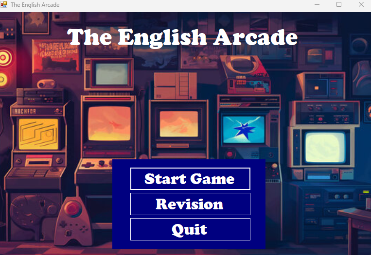

# The English Arcade – Educational Desktop Application
  
 
 The English Arcade is a C# Windows Forms desktop application designed to help users practice and improve their English skills through interactive exercises and mini-games.
 The application includes multiple learning activities such as crossword puzzles, spelling exercises, true/false questions, and picture-based vocabulary training.
 This project was developed as an educational software project demonstrating GUI development, event-driven programming, and interactive learning design using C#.
## About The Project
The goal of this project is to provide an engaging way for users to practice English vocabulary and comprehension through different types of exercises.
The program allows players to select different learning activities and difficulty levels while interacting with a graphical interface.
The project demonstrates:
- Object-oriented programming
- Windows Forms GUI development
- Event-driven programming
- Multi-form application structure
- Educational game design
## Getting Started
### Built With
- C#(.NET)
- Windows Forms
### Prerequisites
- Any C# IDE that supports WinForms (e.g., Visual Studio, Rider, VS Code with C# extension)
- .NET runtime installed
## Installation
1. Clone the repository
2. Open the solution in Visual Studio
3. Build and run the project
4. Start Practising
## Usage
1. Launch the application.
2. Select a player.
3. Choose a difficulty level.
4. Select one of the available exercises:
- Crossword
- Spelling
- True/False
- Picture Vocabulary
5. Complete the activity to practice English vocabulary.
## Features
The application includes several learning modules:
1. Crossword
- Solve crossword puzzles using English vocabulary.
2. Spelling
- Practice spelling words correctly.
3. True / False
- Answer true or false questions to test language knowledge.
4. Picture Vocabulary
- Identify words based on images.
5. Revision
- Review previously learned vocabulary and exercises.
6. Difficulty Selection
- Choose different difficulty levels to match the learner's skill level.
7. Player System
- Allows multiple players to interact with the application.
